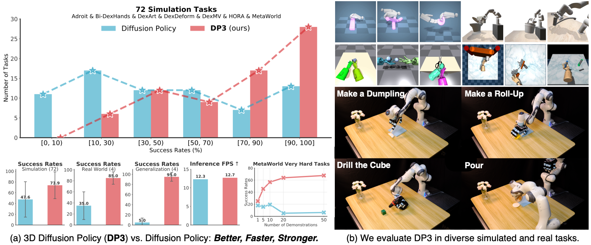

# <a href="https://3d-diffusion-policy.github.io">3D Diffusion Policy</a>

<a href="https://3d-diffusion-policy.github.io"><strong>Project Page</strong></a>
  |
  <a href="https://arxiv.org/abs/2403.03954"><strong>arXiv</strong></a>
  |
  <a href="https://x.com/ZeYanjie/status/1765414787775963232?s=20"><strong>Twitter</strong></a> | <a href="https://1drv.ms/u/s!Ag5QsBIFtRnTlFWqYWtS2wMMPKNX?e=dw8hsS"><strong>Data</strong></a>

  <a href="https://yanjieze.com/">Yanjie Ze*</a>, 
  <a href="https://www.gu-zhang.com/">Gu Zhang*</a>, 
  <a href="https://zkangning.github.io">Kangning Zhang</a>, 
  <a href="https://github.com/pummmmpkin">Chenyuan Hu</a>, 
  <a href="https://wang-muhan.github.io/">Muhan Wang</a>, 
  <a href="http://hxu.rocks/">Huazhe Xu</a>


**Robotics: Science and Systems (RSS) 2024**


<div align="center">
  
</div>

**3D Diffusion Policy (DP3)** is a universal visual imitation learning algorithm that marries 3D visual representations with diffusion policies, achieving surprising effectiveness in diverse simulated and real-world tasks, including both high-dimensional and low-dimensional control tasks, with a practical inference speed.

**Small tips for using DP3:**
- Try [longer prediction horizon](https://github.com/YanjieZe/3D-Diffusion-Policy/blob/b147695af3ecb90101745fe9778ade2f86f23a46/3D-Diffusion-Policy/diffusion_policy_3d/config/dp3.yaml#L10) and [longer action horizon](https://github.com/YanjieZe/3D-Diffusion-Policy/blob/b147695af3ecb90101745fe9778ade2f86f23a46/3D-Diffusion-Policy/diffusion_policy_3d/config/dp3.yaml#L12), e.g., 8/16/32, to get better results.
- Try to use **global position** instead of relative position as **action space**.

**Applications and extensions of DP3 from the community**:
- [arXiv 2025.05](https://arxiv.org/abs/2505.07819), *H3DP: Triply-Hierarchical Diffusion Policy for Visuomotor Learning*, where DP3 shows significantly better results over DP and DP w/ depth.
- [arXiv 2025.03](https://arxiv.org/abs/2503.07511), *PointVLA: Injecting the 3D World into Vision-Language-Action Models*, where [iDP3 Encoder](https://github.com/YanjieZe/Improved-3D-Diffusion-Policy) is used in training a powerful 3D VLA.
- [arXiv 2025.03](https://arxiv.org/abs/2503.08950), *FP3: A 3D Foundation Policy for Robotic Manipulation*, where DP3 shows great generalizability abilities comparable to a large-scale trained 3D policy FP3.
- [arXiv 2025.02](https://arxiv.org/abs/2502.16932), *DemoGen: Synthetic Demonstration Generation for Data-Efficient Visuomotor Policy Learning*, where DP3 can achieve great real-world abilities with generated demos.
- [arXiv 2024.11](https://arxiv.org/abs/2411.09658), *Motion Before Action: Diffusing Object Motion as Manipulation Condition*, where DP3 shows improved effectiveness with a Motion-Before-Action module.
- [arXiv 2024.10](https://arxiv.org/abs/2410.10803), *Generalizable Humanoid Manipulation with 3D Diffusion Policies*, where improved DP3 shows effectiveness in humanoid manipulation tasks and impressive generalization abilities across scenes.
- [arXiv 2024.09](https://arxiv.org/abs/2409.07163), *Mamba Policy: Towards Efficient 3D Diffusion Policy with Hybrid Selective State Models*, where the backbone of DP3 is replaced with the Mamba archiecture.
- [arXiv 2024.09](https://arxiv.org/abs/2409.02920), *RoboTwin: Dual-Arm Robot Benchmark with Generative Digital Twins*, where DP3 is well benchmarked on 6 new simulated bimanual tasks.
- [arXiv 2024.08](https://arxiv.org/abs/2408.11805), *ACE: A Cross-Platform Visual-Exoskeletons System for Low-Cost Dexterous Teleoperation*, where DP3 shows effectiveness in bimanual dexterous tasks.
- [arXiv 2024.07](https://arxiv.org/abs/2407.03162), *Bunny-VisionPro: Real-Time Bimanual Dexterous Teleoperation for Imitation Learning*, where DP3 shows effectiveness in bimanual long-horizon tasks.
- [arXiv 2024.07](https://arxiv.org/abs/2407.01479), *EquiBot: SIM(3)-Equivariant Diffusion Policy for Generalizable and Data Efficient Learning*, where DP3 is able to fold clothes with high success rates. 
- [arXiv 2024.06](https://arxiv.org/abs/2406.01586), *ManiCM: Real-time 3D Diffusion Policy via Consistency Model for Robotic Manipulation*, where DP3 is accelerated via consistency model.
- [arXiv 2024.03](https://arxiv.org/abs/2403.20328), *Learning Visual Quadrupedal Loco-Manipulation from Demonstrations*, where DP3 is used as the high-level planner.


# 📊 Benchmark of DP3

**Simulation environments.** We provide dexterous manipulation environments and expert policies for `Adroit`, `DexArt`, and `MetaWorld` in this codebase (3+4+50=57 tasks in total). the 3D modality generation (depths and point clouds) has been incorporated for these environments.

**Real-world robot data** is also provided [here](https://drive.google.com/file/d/1G5MP6Nzykku9sDDdzy7tlRqMBnKb253O/view?usp=sharing).


**Algorithms**. We provide the implementation of the following algorithms: 
- DP3: `dp3.yaml`
- Simple DP3: `simple_dp3.yaml`

Among these, `dp3.yaml` is the proposed algorithm in our paper, showing a significant improvement over the baselines. During training, DP3 takes ~10G gpu memory and ~3 hours on an Nvidia A40 gpu, thus it is feasible for most researchers.

`simple_dp3.yaml` is a simplified version of DP3, which is much faster in training (1~2 hour) and inference (**25 FPS**) , without much performance loss, thus it is more recommended for robotics researchers.

# 💻 Installation

See [INSTALL.md](INSTALL.md) for installation instructions. 

See [ERROR_CATCH.md](ERROR_CATCH.md) for error catching I personally encountered during installation.

# 📚 Data
You could generate demonstrations by yourself using our provided expert policies.  Generated demonstrations are under `$YOUR_REPO_PATH/3D-Diffusion-Policy/data/`.
- Download Adroit RL experts from [OneDrive](https://1drv.ms/u/s!Ag5QsBIFtRnTlFWqYWtS2wMMPKNX?e=dw8hsS), unzip it, and put the `ckpts` folder under `$YOUR_REPO_PATH/third_party/VRL3/`.
- Download DexArt assets from [Google Drive](https://drive.google.com/file/d/1DxRfB4087PeM3Aejd6cR-RQVgOKdNrL4/view?usp=sharing) and put the `assets` folder under `$YOUR_REPO_PATH/third_party/dexart-release/`.


**Note**: since you are generating demonstrations by yourselves, the results could be slightly different from the results reported in the paper. This is normal since the results of imitation learning highly depend on the demonstration quality. **Please re-generate demonstrations if you encounter some bad demonstrations** and **no need to open a new issue**.

# 🛠️ Usage
Scripts for generating demonstrations, training, and evaluation are all provided in the `scripts/` folder. 

The results are logged by `wandb`, so you need to `wandb login` first to see the results and videos.

For more detailed arguments, please refer to the scripts and the code. We here provide a simple instruction for using the codebase.

1. Generate demonstrations by `gen_demonstration_adroit.sh` and `gen_demonstration_dexart.sh`. See the scripts for details. For example:
    ```bash
    bash scripts/gen_demonstration_adroit.sh hammer
    ```
    This will generate demonstrations for the `hammer` task in Adroit environment. The data will be saved in `3D-Diffusion-Policy/data/` folder automatically.


2. Train and evaluate a policy with behavior cloning. For example:
    ```bash
    bash scripts/train_policy.sh dp3 adroit_hammer 0112 0 0
    ```
    This will train a DP3 policy on the `hammer` task in Adroit environment using point cloud modality. By default we **save** the ckpt (optional in the script).


3. Evaluate a saved policy or use it for inference. Please set  For example:
    ```bash
    bash scripts/eval_policy.sh dp3 adroit_hammer 0112 0 0
    ```
    This will evaluate the saved DP3 policy you just trained. **Note: the evaluation script is only provided for deployment/inference. For benchmarking, please use the results logged in wandb during training.**

# 🤖 Real Robot

**Hardware Setup**
1. Franka Robot
2. Allegro Hand
3. **L515** Realsense Camera (**Note: using the RealSense D435 camera might lead to failure of DP3 due to the very low quality of point clouds**)
4. Mounted connection base [[link](https://drive.google.com/file/d/1kg6yOFxVqP8azxPoXsuyig5DEQnAJjwC/view?usp=sharing)] (connect Franka with Allegro hand)
5. Mounted finger tip [[link](https://github.com/yzqin/dexpoint-release/blob/main/assets/robot/allegro_hand_description/meshes/modified_tip.STL)]

**Software**
1. Ubuntu 20.04.01 (tested)
2. [Franka Interface Control](https://frankaemika.github.io/docs/index.html) 
3. [Frankx](https://github.com/pantor/frankx) (High-Level Motion Library for the Franka Emika Robot)
4. [Allegro Hand Controller - Noetic](https://github.com/NYU-robot-learning/Allegro-Hand-Controller-DIME)


Every collected real robot demonstration (episode length: T) is a dictionary:
1. "point_cloud": Array of shape (T, Np, 6), Np is the number of point clouds, 6 denotes [x, y, z, r, g, b]. **Note: it is highly suggested to crop out the table/background and only leave the useful point clouds in your observation, which demonstrates effectiveness in our real-world experiments.**
2. "image": Array of shape (T, H, W, 3)
3. "depth": Array of shape (T, H, W)
4. "agent_pos": Array of shape (T, Nd), Nd is the action dim of the robot agent, i.e. 22 for our dexhand tasks (6d position of end effector + 16d joint position)
5. "action": Array of shape (T, Nd). We use *relative end-effector position control* for the robot arm and *relative joint-angle position control* for the dex hand.

For training and evaluation, you should process the point clouds (cropping using a bounding box and FPS downsampling) as described in the paper. We also provide an example script ([here](https://github.com/YanjieZe/3D-Diffusion-Policy/tree/master/scripts/convert_real_robot_data.py)). 

You can try using our provided real world data to train the policy.
1. Download the real robot data. Put the data under `3D-Diffusion-Policy/data/` folder, e.g. `3D-Diffusion-Policy/data/realdex_drill.zarr`, please keep the path the same as 'zarr_path' in the task's yaml file.
2. Train the policy. For example:
  ```bash
    bash scripts/train_policy.sh dp3 realdex_drill 0112 0 0
  ```
3. For real-world deployment code, you might refer to [iDP3](https://github.com/YanjieZe/Improved-3D-Diffusion-Policy) for a reference.
   
# 🔍 Visualizer
We provide a simple visualizer to visualize point clouds for the convenience of debugging in headless machines. You could install it by
```bash
cd visualizer
pip install -e .
```
Then you could visualize point clouds by
```python
import visualizer
your_pointcloud = ... # your point cloud data, numpy array with shape (N, 3) or (N, 6)
visualizer.visualize_pointcloud(your_pointcloud)
```
This will show the point cloud in a web browser.


# 🦾 Run On Your Own Tasks
The good part of DP3 is its universality, so that you could easily run DP3 on your own tasks. What you need to add is to make this codebase support the task in our format. Here are some simple steps:


1. Write the environment wrapper for your task. You need to write a wrapper for your environment, to make the environment interface easy to use. See `3D-Diffusion-Policy/diffusion_policy_3d/env/adroit` for an example.


2. Add the environment runner for your task. See `3D-Diffusion-Policy/diffusion_policy_3d/env_runner/` for examples.

3. Prepare expert data for your task. The script `third_party/VRL3/src/gen_demonstration.py` is a good example of how to generate demonstrations in our format. Basically expert data is the state-action pairs saved in a sequence.

4. Add the dataset which loads your data. See `3D-Diffusion-Policy/diffusion_policy_3d/dataset/` for examples.

5. Add the config file in `3D-Diffusion-Policy/diffusion_policy_3d/configs/task`. There have been many examples in the folder.

6. Train and evaluate DP3 on your task. See `3D-Diffusion-Policy/scripts/train_policy.sh` for examples.


# 🏷️ License
This repository is released under the MIT license. See [LICENSE](LICENSE) for additional details.

# 😺 Acknowledgement
Our code is generally built upon: [Diffusion Policy](https://github.com/real-stanford/diffusion_policy), [DexMV](https://github.com/yzqin/dexmv-sim), [DexArt](https://github.com/Kami-code/dexart-release), [VRL3](https://github.com/microsoft/VRL3), [DAPG](https://github.com/aravindr93/hand_dapg), [DexDeform](https://github.com/sizhe-li/DexDeform), [RL3D](https://github.com/YanjieZe/rl3d), [GNFactor](https://github.com/YanjieZe/GNFactor), [H-InDex](https://github.com/YanjieZe/H-InDex), [MetaWorld](https://github.com/Farama-Foundation/Metaworld), [BEE](https://jity16.github.io/BEE/), [Bi-DexHands](https://github.com/PKU-MARL/DexterousHands), [HORA](https://github.com/HaozhiQi/hora). We thank all these authors for their nicely open sourced code and their great contributions to the community.

Contact [Yanjie Ze](https://yanjieze.com) if you have any questions or suggestions.

# 📝 Citation

If you find our work useful, please consider citing:
```
@inproceedings{Ze2024DP3,
	title={3D Diffusion Policy: Generalizable Visuomotor Policy Learning via Simple 3D Representations},
	author={Yanjie Ze and Gu Zhang and Kangning Zhang and Chenyuan Hu and Muhan Wang and Huazhe Xu},
	booktitle={Proceedings of Robotics: Science and Systems (RSS)},
	year={2024}
}
```
